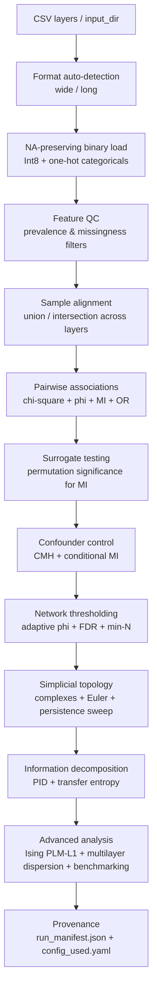

# bact-assoc-net

[](https://github.com/MK-vet/bact-assoc-net/actions/workflows/ci.yaml)
[](https://pypi.org/project/bact-assoc-net/)
[](https://pypi.org/project/bact-assoc-net/)
[](LICENSE)

Information-theoretic multi-layer network analysis with transfer entropy, partial information decomposition, and simplicial topology.

## Pipeline Architecture



## Analyses Performed

### Data Ingestion & Quality Control

1. **Multi-format CSV loading** — automatic detection of wide (samples x features) vs long (tidy) format
2. **Auto-discovery of CSV layers** — scans input directory for all CSV files when `input_dir` is specified
3. **NA-preserving binary coercion** — nullable Int8 dtype; categorical columns one-hot encoded; missing values never coerced to 0
4. **Feature QC filtering** — removes features below prevalence threshold or above missingness threshold (user-configurable)
5. **Layer coverage reporting** — per-layer: N_total, N_observed, coverage fraction, missing cell count
6. **Sample alignment** — union (all samples, fill missing) or intersection (only shared samples) across layers

### Pairwise Association Statistics

7. **Chi-square test** — with Fisher exact fallback (adaptive selection by expected cell frequencies)
8. **Phi coefficient** — with Fisher-z confidence intervals
9. **Mutual information** — Shannon H, joint H, conditional H, MI, NMI (normalised mutual information)
10. **Odds ratio** — with Bayesian Jeffreys CI (add-0.5 correction for zero cells)
11. **Contingency table output** — complete 2x2 table (a00, a01, a10, a11) for every pair
12. **Effect direction classification** — co-occur vs exclusive based on observed vs expected frequencies

### Surrogate Testing

13. **Surrogate-tested MI** — permutation significance testing with Z-score and empirical p-value

### Confounder Control

14. **Cochran-Mantel-Haenszel stratified test** — CMH statistic with stratified odds ratio
15. **Conditional mutual information** — CMI stratified by specified confounder variables

### Network Construction

16. **Adaptive phi thresholding** — percentile, IQR, or statistical threshold methods
17. **FDR correction** — Benjamini-Hochberg across all pairwise tests
18. **Minimum pairwise N filtering** — excludes pairs with insufficient joint observations
19. **Network summary statistics** — nodes, edges, connected components, average degree

### Simplicial Topology

20. **Simplicial complex construction** — nodes, edges, triangles, and higher-order simplices from significant associations
21. **Euler characteristic** — topological invariant: V - E + T - ...
22. **Topology persistence sweep** — simplicial counts (V, E, T, chi) across phi threshold range
23. **Derived persistence metrics** — dV, dE, dTriangles, TriangleDensity, EdgePerNode across thresholds

### Information Decomposition

24. **Partial Information Decomposition** — I_min redundancy, unique information, synergy per source pair x target (Williams & Beer 2010)
25. **Transfer entropy** — directional information flow with explicit guard against cross-sectional misuse (Schreiber 2000)
26. **Mutual exclusivity detection** — k-tuples of features that never co-occur

### Advanced Network Analysis

27. **Direct conditional interactions** — PLM-L1 Ising model proxy via per-node logistic regression with L1 penalty
28. **Multilayer dispersion** — Jensen-Shannon divergence and participation coefficient per feature across layers
29. **Layer-level information flow** — inter-layer MI/phi aggregation (mean association strength between layers)

### Benchmarking

30. **Graph inference model comparison** — PLM-L1 vs GraphicalLasso vs LegacyPrecision with bootstrap Jaccard stability

### Provenance

31. **Config validation** — schema check, unknown key detection, strict mode
32. **Run manifest** — SHA256 input hashes, package versions, platform, random seed, config snapshot

## Complete Output Files

| File | Description |
|------|-------------|
| `associations_all.csv` | Chi-square, phi, MI, NMI, OR, contingency tables for all pairs |
| `associations_filtered.csv` | Significant associations above threshold with FDR correction |
| `association_network.graphml` | Network for Cytoscape/Gephi |
| `network_summary.csv` | Nodes, edges, components, average degree |
| `surrogate_mi.csv` | Permutation-tested MI with Z-scores and p-values |
| `cmh_stratified.csv` | CMH statistics and stratified odds ratios |
| `cmi_conditional.csv` | Conditional MI controlling for confounders |
| `simplicial_complex.csv` | Betti numbers and Euler characteristic |
| `simplicial_sweep.csv` | Simplicial counts across phi thresholds |
| `topology_persistence.csv` | Derived persistence metrics across thresholds |
| `pid.csv` | PID decomposition: redundancy, unique, synergy per triplet |
| `transfer_entropy.csv` | TE forward, reverse, net for all pairs |
| `mutual_exclusivity.csv` | k-tuples of non-co-occurring features |
| `ising_direct_edges.csv` | PLM-L1 direct conditional interaction strengths |
| `multilayer_dispersion.csv` | JSD and participation coefficient per feature |
| `layer_flow.csv` | Inter-layer MI/phi means |
| `model_comparison.csv` | PLM-L1 vs GraphicalLasso vs LegacyPrecision Jaccard stability |
| `layer_coverage.csv` | Per-layer sample counts and coverage fractions |
| `feature_qc.csv` | Per-feature prevalence, missingness, pass/fail |
| `config_used.yaml` | Exact configuration snapshot |
| `run_manifest.json` | Provenance: hashes, versions, platform, seed |
| `config_validation.json` | Schema validation results |

## Installation

```bash
pip install bact-assoc-net
pip install bact-assoc-net[all]       # all optional features
```

Optional feature groups:

| Extra | Packages | Features |
|-------|----------|----------|
| `gui` | marimo>=0.9, plotly>=5.18, matplotlib>=3.7 | Interactive dashboard |
| `dev` | pytest>=7, pytest-cov>=4, ruff>=0.4 | Development & testing |

## Quick Start

### CLI

```bash
bact-assoc-net config.yaml -v
```

### Python API

```python
from bactassocnet.config import Config
from bactassocnet.pipeline import Pipeline

cfg = Config.from_yaml("config.yaml")
results = Pipeline(cfg).run()
```

## Interactive Dashboard (marimo)

```bash
bact-assoc-net-dashboard
bact-assoc-net-dashboard --edit   # edit mode
```

## CLI Reference

| Argument | Description |
|----------|-------------|
| `config` | Path to YAML configuration file (positional) |
| `-o`, `--output-dir` | Output directory (default: `results/`) |
| `-v`, `--verbose` | Verbose logging |
| `--seed` | Random seed for reproducibility |
| `--skip-pid` | Skip Partial Information Decomposition |
| `--skip-te` | Skip transfer entropy |
| `--skip-topology` | Skip simplicial topology analysis |
| `--skip-ising` | Skip PLM-L1 Ising model |
| `--skip-benchmark` | Skip model comparison benchmark |
| `--selfcheck` | Run self-check on synthetic data and exit |
| `--benchmark` | Run performance benchmark and exit |
| `--version` | Show version and exit |

## Configuration

Layers can be specified explicitly or auto-discovered from a directory:

```yaml
# Option 1: explicit layers
layers:
  - name: MIC
    path: data/MIC.csv
  - name: AMR_genes
    path: data/AMR_genes.csv

# Option 2: auto-discover all CSVs in directory
input_dir: data/

network:
  threshold_method: iqr    # percentile | iqr | statistical
  fdr_alpha: 0.05
  min_n: 10

topology:
  sweep_min: 0.0
  sweep_max: 1.0
  sweep_steps: 50

pid:
  enabled: true

transfer_entropy:
  enabled: true
  n_surrogates: 1000

ising:
  enabled: true
  alpha: 0.01

qc:
  min_prevalence: 0.01
  max_missingness: 0.5

alignment: union   # union | intersection
```

See `examples/config.yaml` for a complete template.

## Data Quality & Reliability

- **Dataset preflight** — coverage, duplicates, missing data audit, SHA256 checksums
- **Feature informativeness index** — entropy, variance, prevalence per feature
- **Degeneracy detection** — flags constant features and all-missing columns
- **Pairwise ID overlap** — Jaccard index and recall across layers
- **Quality gate** — PASS / WARN / FAIL with configurable thresholds
- **Sensitivity mini-runs** — subsampling stability proxy
- **Cross-tool consistency** — ARI, NMI, bias-corrected Cramer's V against other tools

## Reproducibility

Every run produces:

- `run_manifest.json` — tool version, Python version, platform, random seed, input file SHA256 hashes, installed package versions, full config snapshot
- `config_used.yaml` — exact configuration used for the run
- `config_validation.json` — schema validation results with warnings for unknown keys

## Scope

**What this tool does:**
Pairwise and higher-order association network construction, information-theoretic analysis (MI, PID, transfer entropy), simplicial topology, confounder-controlled tests, and direct conditional interaction estimation.

**What this tool does NOT do:**
Clustering or profiling (see bact-trait-cluster), MDR classification (see bact-mdr-profiler), phylogenetic comparative methods (see bact-phylo-trait). Each tool has a distinct analytical scope with no overlapping computations.

## Testing

```bash
pip install -e ".[dev]"
pytest tests/ -v
```

## How to Cite

If you use bact-assoc-net in your research, please cite:

> Kochanowski M. bact-assoc-net: information-theoretic multi-layer network analysis with transfer entropy, partial information decomposition, and simplicial topology. https://github.com/MK-vet/bact-assoc-net

## License

MIT
